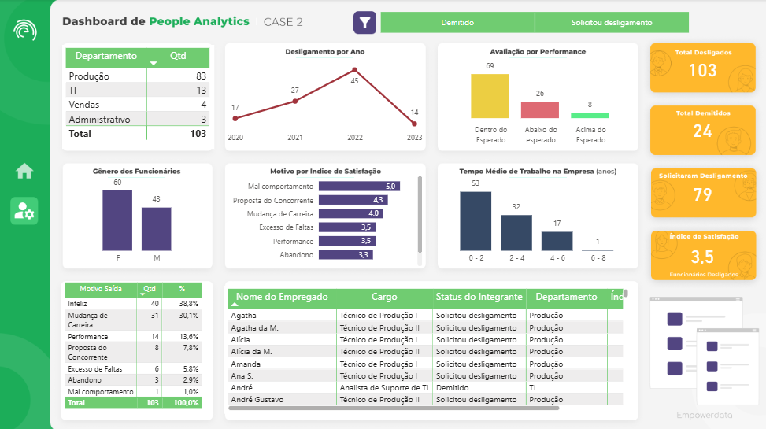

# [People Analytics]

## Objetivo
O objetivo principal é identificar e propor soluções para o alto índice de turnover da empresa, que superou a média do mercado. Para isso, são sugeridas análises detalhadas sobre o quadro de funcionários, como custos de folha de pagamento, percentual de gênero, fontes de recrutamento e desempenho.

## Dados Utilizados
Registro Performance.csv & RH Base de dados.xlsx

## Principais insights
- Rotatividade: Alta rotatividade no setor de Produção, especialmente no início do vínculo (0–2 anos).
- Satisfação: Baixa satisfação (3,5) entre os desligados; "infeliz" é o principal motivo.
- Remuneração: Salários mais altos no TI, mas não correlacionados diretamente com satisfação.
- Recrutamento: Sites de vagas são a principal fonte de contratação, mas podem atrair talentos com menor comprometimento.
- Clima Organizacional: Problemas com clima e engajamento, especialmente no Produção e Administrativo.
- Desempenho: Muitos desligados tinham performance dentro do esperado, indicando que fatores emocionais/organizacionais são mais críticos.
 
Tratamento de dados: Organização do tipos dos dados e cáculo da idade dos funcionários

## Cálculos Realizados:
custo_mensal = custo_mensal = CALCULATE(sum(bdintegrantes[Salário]), bdintegrantes[Status do Integrante] = "Ativo")
indice_satisfacaogeral = AVERAGE(bdintegrantes[Índice de Satisfação])
media_salario = CALCULATE(AVERAGE(bdintegrantes[Salário]), bdintegrantes[Status do Integrante] = "Ativo")
media_satisfacao = CALCULATE(AVERAGE(bdintegrantes[Índice de Satisfação]), bdintegrantes[Status do Integrante] = "Ativo")
mediaempresa = AVERAGEX(bdintegrantes, IF(ISBLANK(bdintegrantes[Data de Saída]), DATEDIFF(bdintegrantes[Data de Contratação],"01/01/2024",MONTH)/12, DATEDIFF(bdintegrantes[Data de Contratação],bdintegrantes[Data de Saída],MONTH)/12))
solicitou_desl = CALCULATE(COUNTROWS(bdintegrantes),bdintegrantes[Status do Integrante] = "Solicitou desligamento")+0
total_demitidos = CALCULATE(COUNTROWS(bdintegrantes),bdintegrantes[Status do Integrante] = "Demitido")+0   
total_funcatv = COUNTROWS(FILTER(bdintegrantes,bdintegrantes[Status do Integrante] = "Ativo"))
totalintegrantes = COUNTROWS(bdintegrantes)

## Screenshots

