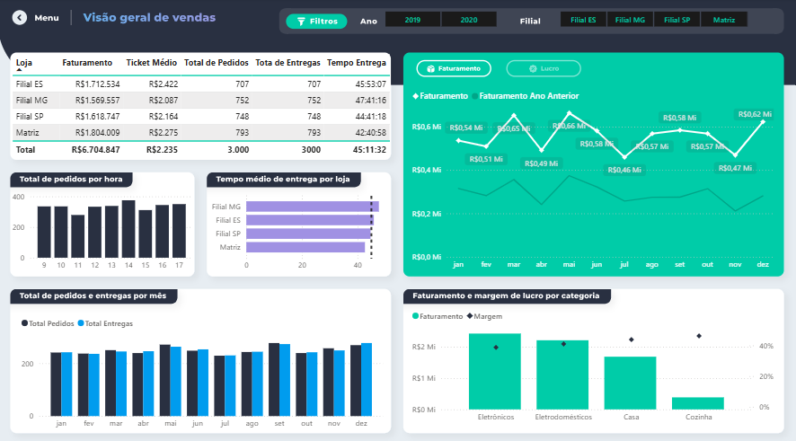
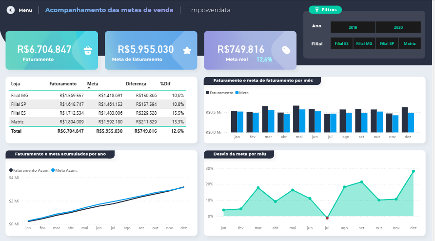

# [Analise de Vendas]

## Objetivo
Acompanhar as vendas analisando o faturamento e metas dos anos 2019 e 2020, análise do lucro, margem por categoria.

## Dados utilizados
BD.xlsx

## Principais insights
- No ano de 2020 tivemos somente 5 meses com a meta geral superada
- 2020 a matriz ficou -8,9% abaixo da meta
- A loja Filial ES superou a meta em 7,6%

## Screenshots

