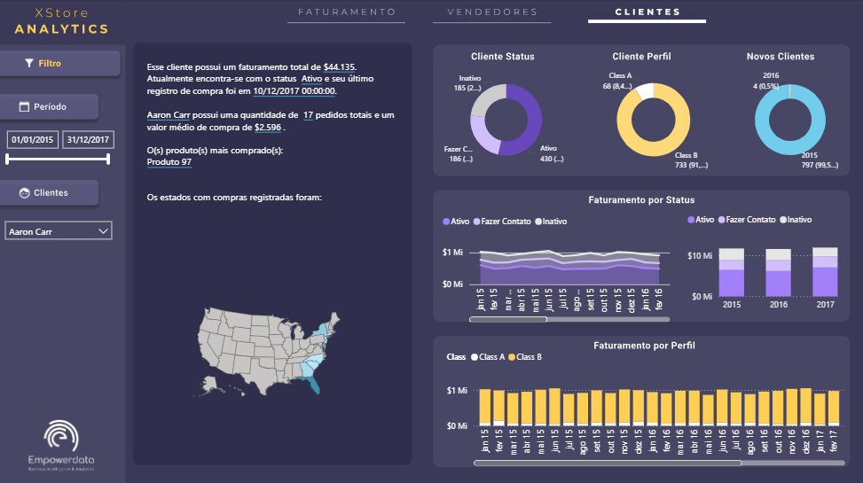
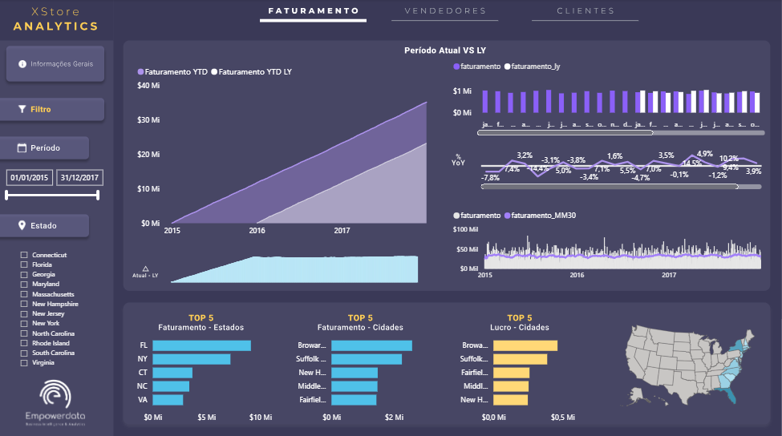
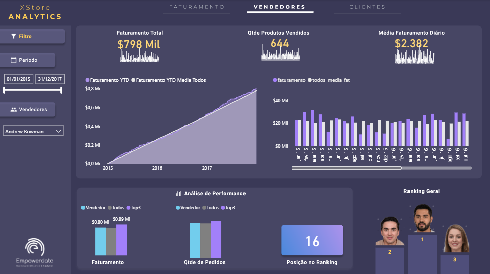

# [Xstore Sales Analytics]

## Objetivo
O projeto inclui a criação de três dashboards principais: uma visão geral do faturamento por região e período, uma análise do desempenho dos vendedores e uma avaliação detalhada da carteira de clientes, com segmentação por status e perfil.

## Dados utilizados
BD.xlsx

## Principais insights
- Painel de analise de cliente individual com texto inteligente mostrando as principais informações
- Ranking dos melhores vendedores pela quantidade de pedidos e faturamento
- Visão geral do faturamento

## Screenshots

